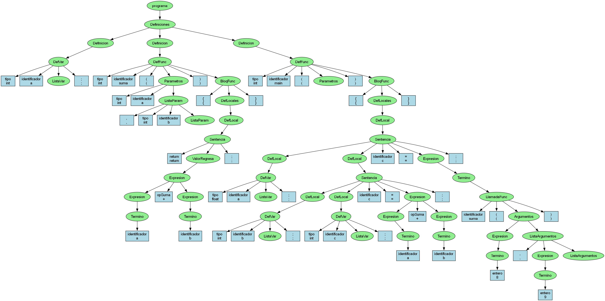

# Analizador Sintáctico LR para Lenguaje C Simplificado

Este repositorio contiene un analizador léxico y sintáctico completo en Python que implementa un parser LR para un subconjunto del lenguaje C. El sistema utiliza una tabla LR externa (`compilador.lr`) junto con su archivo de columnas CSV (`compilador.csv`) para realizar análisis sintáctico robusto y generar árboles sintácticos abstractos (AST) detallados.



## Características principales

### 🔍 **Analizador Léxico**
- Reconoce tokens del lenguaje C: tipos de datos, identificadores, operadores, literales
- Manejo de comentarios de línea (`//`) y bloque (`/* */`)
- Detección precisa de errores léxicos con información de línea y columna
- Soporte para cadenas con caracteres de escape

### 🌳 **Analizador Sintáctico LR**
- Parser LR completo con tabla de parsing externa
- Construcción de AST con **desglose completo** de la estructura sintáctica
- Soporte para gramática R1-R52 con 52 reglas de producción
- Manejo inteligente de conflictos reduce-reduce con priorización por validez de GOTO
- Optimización de nodos recursivos para evitar anidamiento excesivo

### 📝 **Estructuras soportadas**
- **Variables**: Declaraciones simples y listas (`int x, y, z;`)
- **Funciones**: Definición con parámetros y cuerpo (`int suma(int a, int b) { ... }`)
- **Expresiones**: Aritméticas, relacionales, lógicas, asignaciones
- **Sentencias**: if-else, while, return, bloques
- **Llamadas a función**: Con argumentos múltiples (`suma(x, y)`)
- **Scope**: Variables locales y globales

## Requisitos
- Python 3.8 o superior
- (Opcional) Graphviz para visualización de AST (`dot` en PATH)
 

## Uso

### Ejecución básica
```powershell
python main.py
```

### Ejemplos soportados

El analizador puede procesar programas C como:

```c
// Variables globales
int x, y;

// Función con parámetros
int suma(int a, int b) {
    return a + b;
}

// Función main con variables locales
int main() {
    int resultado;
    resultado = suma(x, y);
    return resultado;
}
```

### Salida del programa
1. **Tokens**: Lista detallada de todos los tokens reconocidos
2. **Debugging LR**: Trazas del proceso de parsing (estados, transiciones, reducciones)
3. **AST textual**: Representación jerárquica del árbol sintáctico
4. **AST gráfico**: 
   - `ast.dot`: Archivo DOT para Graphviz
   - `ast.png`: Imagen del AST (si Graphviz está disponible)

## Arquitectura del sistema

### Archivos principales
- `main.py` — Analizador completo con lexer y parser LR
- `compilador.lr` — 52 reglas de gramática y tabla LR (95×46)
- `compilador.csv` — Mapeo de 24 terminales y 22 no terminales
- `ast.dot` / `ast.png` — Visualización del AST generado

### Gramática soportada (R1-R52)
El sistema implementa una gramática completa para:
- **R1-R3**: Programa y definiciones
- **R4-R6**: Definiciones de variables y funciones  
- **R7-R8**: Listas de variables
- **R9-R14**: Definiciones de funciones y bloques
- **R15-R26**: Definiciones locales y sentencias
- **R27-R42**: Expresiones y términos
- **R43-R52**: Argumentos y llamadas a función

## Funcionalidades avanzadas

### 🔧 **Sistema de debugging**
- Trazas completas del proceso LR con estados y transiciones
- Información detallada de candidatos en conflictos reduce-reduce
- Mapeo explícito entre reglas internas (0-51) y gramática formal (R1-R52)

### 🎯 **Manejo de errores robusto**
- `LexicalError`: Errores de tokenización con posición exacta
- `SyntaxError`: Errores de parsing con contexto del estado LR
- Validación de tabla LR y detección de GOTOs inválidos

### 🌲 **Optimización de AST**
- Combinación inteligente de nodos recursivos
- Preservación de estructura sintáctica completa
- Representación textual y gráfica optimizada

## Personalización

Para analizar otros programas, modifica la variable `ejemplo` en `main.py`:

```python
ejemplo = """
// Tu código C aquí
int factorial(int n) {
    if (n <= 1) return 1;
    return n * factorial(n - 1);
}
"""
```

## Contribución y desarrollo

### Estructura del código
- **Clase `Token`**: Representación de tokens con tipo, valor y posición
- **Clase `Node`**: Nodos del AST con estado (TERMINAL/NO_TERMINAL)
- **Función `analizar()`**: Analizador léxico completo
- **Método `parse_lr()`**: Parser LR con manejo de conflictos
- **Función `ast_to_dot()`**: Generador de visualización DOT

### Debugging y desarrollo
El sistema incluye traces detallados que se pueden usar para:
- Analizar el comportamiento del parser LR
- Identificar problemas en la gramática
- Optimizar el rendimiento del análisis

Para habilitar más debugging, busca las líneas `print(f"[DEBUG]")` en el código.


